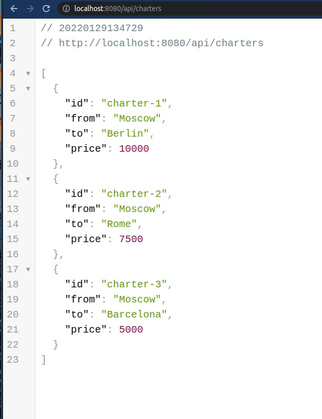
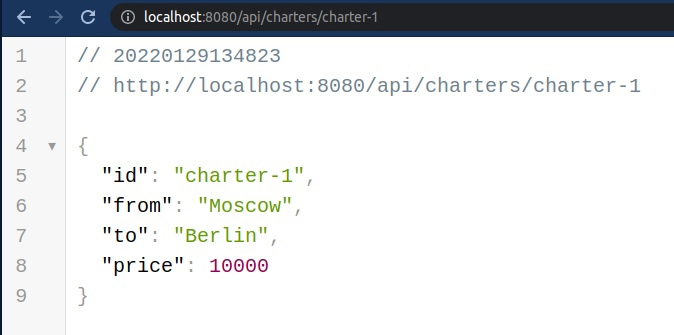
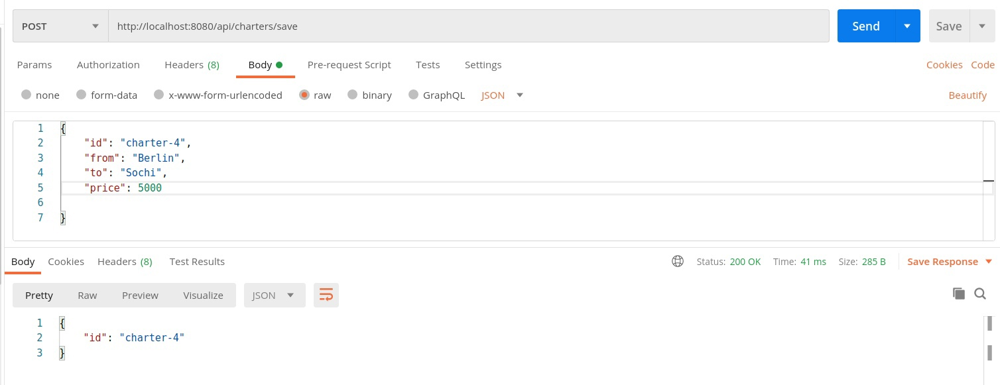

# Развертывание
У вас должен быть установлен docker и утилита docker-compose. Из корня проекта запустить команду:
```bash
$ docker-compose up -d
```
## Структура папок

```
/src
    /routes
    /services
    /repositories
    /utils
```

-   `routes:` Тут описываются доступные методы rest api

-   `services`: Слой между репозиториями и обработчиком метода

-   `repositories`: Репозитории для "сущностей" (в нашем случае имитация сущностей)

-   `utils`: Полезные хелперы, обраотка ошибок

## Демо

```
/api/charters
```


```
/api/charters/charter-1
```


```
/api/charters/save
```

